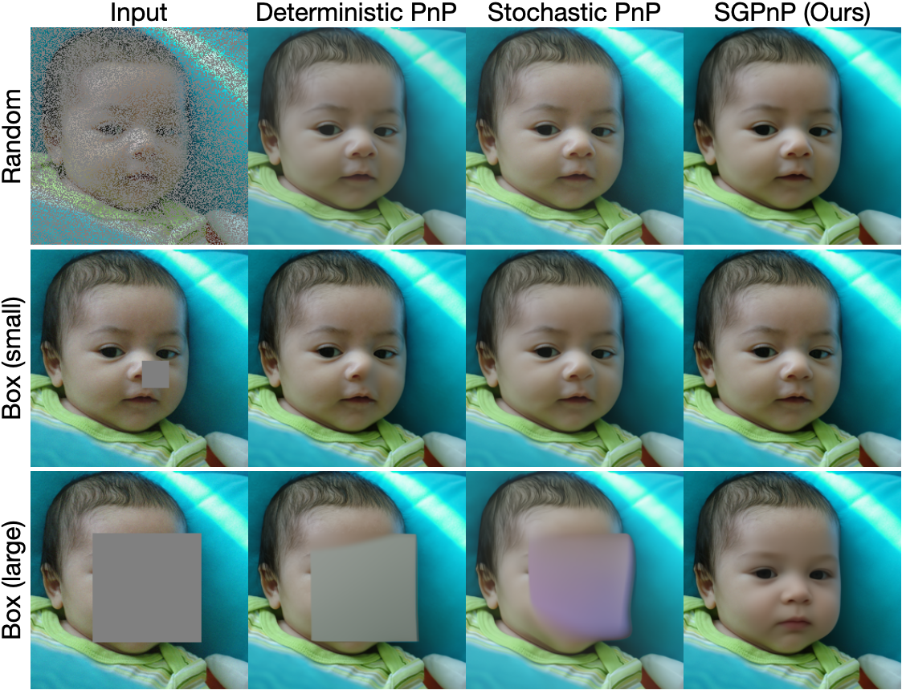

# Stochastic Generative Plug-and-Play Priors

[[arXiv]](https://arxiv.org/abs/2412.11108)



## Abstract
Plug-and-play (PnP) methods are widely used for solving imaging inverse problems by incorporating a denoiser into optimization algorithms. Score-based diffusion models (SBDMs) have recently demonstrated strong generative performance through a denoiser trained across a wide range of noise levels. Despite their shared reliance on denoisers, it remains unclear how to systematically use SBDMs as priors within the PnP framework without relying on reverse diffusion sampling. In this paper, we establish a score-based interpretation of PnP that justifies using pretrained SBDMs directly within PnP algorithms. Building on this connection, we introduce a stochastic generative PnP (SGPnP) framework that injects noise to better leverage the expressive generative SBDM priors, thereby improving robustness in severely ill-posed inverse problems. We provide a new theory showing that this noise injection induces optimization on a Gaussian-smoothed objective and promotes escape from strict saddle points. Experiments on challenging inverse tasks, such as multi-coil MRI reconstruction and large-mask natural image inpainting, demonstrate consistent improvement over conventional PnP methods and achieve performance competitive with diffusion-based solvers.


## Environment setting

### 1) Clone the repository
```
git clone https://github.com/uw-cig/SGPnP

cd SGPnP
```

### 2) Download Pretrained Score Function

- Download **diffusion model** trained on the FFHQ 256x256 dataset [Pretrained model link](https://drive.google.com/drive/folders/1jElnRoFv7b31fG0v6pTSQkelbSX3xGZh?usp=sharing). The default save directory is `./pretrained_models/ffhq_10m.pt`.

- Download **diffusion model** trained on the fastMRI 256x256 dataset [Pretrained model link](https://drive.google.com/file/d/1UOSic2U-AIw_5pp_aNtdi6SnnMsJRKRW/view?usp=sharing). The default save directory is `./pretrained_models/fmri_uncond_R1_noise0_0_img256.pt`.


### 3) Virtual environment setup
```
conda create -n SGPnP python=3.9.19

conda activate SGPnP

conda install -c conda-forge mpi4py mpich

pip install -r requirements.txt
```

## Run experiment

### 1) Pick one task from `configs` directory:

#### Stochastic Generative Plug-and-Play (SGPnP)

  - `configs/SGPnP_PGM/SGPnP_PGM_ffhq_superresolution.yaml`
  - `configs/SGPnP_PGM/SGPnP_PGM_ffhq_blur.yaml`
  - `configs/SGPnP_PGM/SGPnP_PGM_ffhq_boxinpainting.yaml`
  - `configs/SGPnP_ADMM/SGPnP_ADMM_ffhq_blur.yaml`
  - `configs/SGPnP_DPIR/SGPnP_DPIR_ffhq_blur.yaml`

#### Score-based Deterministic Plug-and-Play (SDPnP)

  - `configs/SDPnP_PGM/SDPnP_PGM_ffhq_superresolution.yaml`
  - `configs/SDPnP_PGM/SDPnP_PGM_ffhq_blur.yaml`
  - `configs/SDPnP_PGM/SDPnP_PGM_ffhq_boxinpainting.yaml`
  - `configs/SDPnP_ADMM/SDPnP_ADMM_ffhq_blur.yaml`
  - `configs/SDPnP_DPIR/SDPnP_DPIR_ffhq_blur.yaml`


### 2) Execute the code
```
python sample.py --config configs/{YAML_FILE_NAME}.yaml    # example code: python sample.py --config configs/SGPnP_PGM/SGPnP_PGM_ffhq_boxinpainting.yaml
```

## Implementation detail

```
sample.py                                            # Read yaml file / set forward operator and data transform / initialize models
│   
└────────── guided_diffusion/SGPnP_iteration.py      # Run SGPnP or SDPnP
```


<h2 style="color:red;">Troubleshooting</h2>

```diff
! If you encounter any issues, feel free to reach out via email at chicago.park@wisc.edu. 
```

## Code references

We adopt the code structure from [Deepinverse repo](https://deepinv.github.io/deepinv/index.html) and [guided-diffusion repo](https://github.com/openai/guided-diffusion).


## Citation

If you find our work useful, please consider citing

```
@article{park2026scorepnp,
  title={Stochastic Generatie Plug-and-Play Priors},
	author={Park, Chicago Y.
		and Chandler, Edward P.
		and Hu, Yuyang
		and McCann, Michael T.
		and Garcia-Cardona, Cristina
		and Wohlberg, Brendt
		and Kamilov, Ulugbek S.},
  journal   = {arXiv:},
  year      = {2026}
}
```